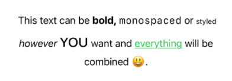

# JoinedText

A **SwiftUI** view for combining multiple `Text` views into a single `Text` instance.

```swift
Text {
    Text("This text can be")
    if isTrue {
        Text("bold,")
            .fontWeight(.bold)
        Text("monospaced")
            .font(.system(.body, design: .monospaced))
        Text("or")
    }
    Text("styled")
        .font(.system(.caption))
    Text("however")
        .italic()
    Text("you")
        .font(Font.title.smallCaps())
    Text("want and")
    Text("everything")
        .foregroundColor(.green)
        .underline()
    Text("will be combined 😃.")
}
```



# Description
Similarly to how you can build regular view hierarchies, this library provides you with an additional initializer for `Text` view, that you can use to build complex sentences with varying styles. Inside of text definition block, you can use common code instructions such as `if`, `if else`, `switch` and similar statements to build complex multi style sentences.

## Usage

### Basics
You can use `Text(_ content:)` initializer to build your sentence from multiple `Text` views provided in passed closure.

```swift
Text {
    Text("Example")
    Text("sentence").bold()
}
```
**Output:**
> Example **sentence**

### String separator
By default all `Text`s declared inside of content block will be separated by a space character. You can change this behavior by providing your own separator text.

```swift
Text(separator: "-") {
    Text("joined")
    Text("with")
    Text("dashes")
}
```
**Output:**
> joined-with-dashes

### Advanced separator
For even more control, like additional styling, pass in `Text` instance as a separator.

```swift
Text(separator: Text(" ! ").bold()) {
    Text("bold")
    Text("exclamation")
    Text("mark")
}
```
**Output:**
> bold **!** exclamation **!** mark

### Control flow
Inside of text definition blocks you can use control flow statements such as `if`, `switch` or `if let` to build your combined `Text`.

```swift
Text {
   Text("Hello,")
   if let name = yourName {
       Text(name).bold()
   } else {
       Text("what is your name?")
   }
}
```
**Output:**
> Hello, **Łukasz**